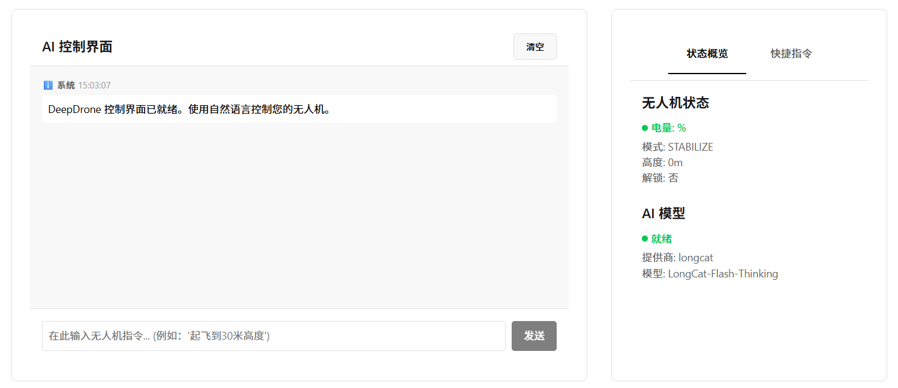

# 🚁 DeepDrone - AI-Powered Drone Control System



**Control drones with natural language using the latest AI models from 11 major providers: OpenAI GPT-5.2, Anthropic Claude 4.5, Google Gemini 3 Pro Preview, Alibaba Qwen3 Max, xAI Grok 4.1, ZhipuAI GLM-4.6, DeepSeek, Moonshot Kimi K2 Thinking, LongCat Flash, Meta Llama 4, and local/network Ollama models.**

---

**🌐 Language Versions | 语言版本**

[](README.md) [](README_ZH.md)

**🤖 AI Assistant | AI 助手**

<a href="https://deepwiki.com/LeaderOnePro/deepdrone">
  
</a>
<a href="https://zread.ai/LeaderOnePro/deepdrone" target="_blank"></a>

---

## 🚀 Quick Start

### Terminal Interface
```bash
# 1. Install dependencies
pip install -r requirements.txt

# 2. Start interactive setup
python main.py
```

### Web Interface
```bash
# One-click web start
python start_web.py
# Visit: http://localhost:8000
```

The app will guide you through:
- **AI Provider Selection**: Choose from 11 providers with latest models
- **Model Selection**: Pick from cutting-edge AI models (network Ollama supported)
- **Drone Connection**: Connect to simulator or real drone
- **Natural Language Control**: "Take off to 30 meters", "Fly in a square pattern"

## ✨ Features

- 🤖 **Comprehensive AI Support**: 11 major providers with latest models (GPT-5.2, Claude 4.5, Gemini 3 Pro Preview, Kimi K2 Thinking, LongCat Flash, Llama 4, Grok 4.1, etc.)
- 🌐 **Dual Interface**: Terminal CLI and modern web interface
- 🌐 **Network Flexibility**: Local, LAN, and internet Ollama server support
- 🚁 **Real Drone Control**: DroneKit integration for actual flight control
- 💬 **Natural Language**: Control drones with conversational commands
- 🛠️ **Built-in Simulator**: Includes drone simulator for testing
- 🔒 **Safe Operations**: Emergency stops and return-to-home functions
- 📱 **Mobile Ready**: Responsive web interface with touch support

## 🛠️ Simulator Setup

```bash
# Quick simulator (included)
python simulate_drone.py

# Advanced SITL (optional)
# Follow ArduPilot SITL installation guide
```

## 📝 Example Commands

```
🚁 DeepDrone> Connect to simulator and take off to 20 meters
🚁 DeepDrone> Fly to GPS coordinates 37.7749, -122.4194
🚁 DeepDrone> Execute a square flight pattern with 50m sides
🚁 DeepDrone> Return home and land safely
```

## 🤖 Supported AI Providers

| Provider | Models | API Type | Description |
|----------|--------|----------|-------------|
| **OpenAI** | GPT-5.2, GPT-5.1-Codex-Max, GPT-5.1-Codex-Mini, GPT-5.1-Codex, GPT-5.1, GPT-5-mini, GPT-5-nano | Cloud | Latest GPT-5.2 and GPT-5.1 series models |
| **Anthropic** | Claude Opus 4.5, Claude Sonnet 4.5, etc | Cloud | Advanced Claude 4.5 models |
| **Google** | Gemini 3 Pro Preview, Gemini 3 Flash Preview, Gemini 2.5 Pro, Gemini 2.5 Flash, Gemini 2.5 Flash Lite | Cloud | Gemini 3 and Gemini 2.5 models from Google AI Studio |
| **Qwen** | Qwen3 Max, Qwen3 235B Instruct 2507, Qwen3 Coder Plus, Qwen3 Next 80B | Cloud | DashScope OpenAI-compatible endpoints |
| **xAI** | Grok 4.1 Fast Reasoning, Grok 4.1 Fast Non-Reasoning, Grok 4 | Cloud | Elon Musk's xAI models |
| **ZhipuAI** | GLM-4.6, GLM-4.5-Air, etc | Cloud | Chinese AI models with JWT auth |
| **DeepSeek** | DeepSeek Chat, DeepSeek Reasoner, etc | Cloud | Advanced reasoning models |
| **Moonshot (Kimi)** | Kimi K2 Thinking Turbo, Kimi K2 Turbo, Kimi K2 Thinking, Kimi K2 0905 Preview | Cloud | Moonshot AI Kimi K2 models with thinking support |
| **LongCat** | LongCat Flash Chat, LongCat Flash Thinking | Cloud | OpenAI-compatible LongCat Flash models |
| **Meta** | Llama 4 Maverick, Llama 3.3 Turbo, etc | Cloud | Latest Llama models via providers |
| **Ollama** | Qwen3:4B, GPT-OSS, Qwen3:30B, etc | Local/Network | Local & remote server support |

## 🔧 Requirements

- Python 3.8+
- DroneKit-Python
- LiteLLM for cloud models
- Ollama for local/network models (optional)

## 💻 Tech Stack

- **LiteLLM** - Unified interface for cloud AI models (OpenAI, Anthropic, Google, xAI, etc.)
- **Direct API Integration** - Native support for ZhipuAI, Qwen (DashScope), DeepSeek, Moonshot Kimi
- **Ollama** - Local/Network AI model execution with custom server support
- **DroneKit-Python** - Real drone control and telemetry
- **Rich** - Beautiful terminal interface and formatting
- **Typer** - Command-line interface framework
- **Pydantic** - Configuration management and validation

## 🌐 Web Interface

DeepDrone includes a modern web interface for browser-based drone control with a sleek, responsive design.

### 🎯 Web Features

- **🖥️ Modern UI**: Responsive design with custom CSS design system (no Material-UI dependencies)
- **🤖 AI Integration**: Real-time chat interface with natural language control
- **🚁 Drone Control**: Live status monitoring and quick command buttons
- **📊 Dashboard**: System overview with real-time data visualization
- **📱 Mobile Support**: Touch-friendly interface with bottom navigation

### 🚀 Web Quick Start

```bash
# Option 1: One-click start (recommended)
python start_web.py

# Option 2: Manual start
python web_api.py
# Then visit: http://localhost:8000
```


### 🛠️ Web Tech Stack

- **Backend**: FastAPI + Uvicorn with RESTful API
- **Frontend**: React 18 with custom CSS design system
- **Real-time**: WebSocket support for live updates
- **Responsive**: Mobile-first design with touch support

## 🌐 Network Features

- **Ollama Network Support**: Connect to Ollama servers on LAN or internet
- **Custom Server URLs**: Configure remote Ollama instances
- **Auto Model Detection**: Automatically detect available models on any server
- **Flexible Deployment**: Run models locally or on powerful remote servers## 
🔧 Web Interface Configuration

### Connection Examples
- **Simulator**: `udp:127.0.0.1:14550`
- **USB Connection**: `/dev/ttyACM0` (Linux) or `COM3` (Windows)
- **TCP Connection**: `tcp:192.168.1.100:5760`
- **UDP Connection**: `udp:192.168.1.100:14550`

### AI Model Setup
1. Navigate to Settings page in web interface
2. Select AI provider from dropdown
3. Choose model (Ollama models auto-detected)
4. Enter API key (not needed for Ollama)
5. Test connection and save

## 🐛 Troubleshooting


**AI model connection fails:**
- Verify API key is correct
- Check network connectivity
- Review browser console for errors

**Drone connection fails:**
- Confirm connection string format
- Ensure simulator is running
- Check serial port permissions (Linux/Mac)

### General Issues

**Ollama connection fails:**
- Verify Ollama server is running
- Check base URL configuration
- Ensure models are installed: `ollama pull model_name`

**Simulator not responding:**
- Restart simulator: `python simulate_drone.py`
- Check connection string matches simulator port
- Verify no other processes using the port

## 🚀 Deployment

### Development
```bash
# Terminal interface
python main.py

# Web interface with hot reload
cd frontend
npm start  # Frontend (port 3000)
# In another terminal:
uvicorn web_api:app --reload  # Backend (port 8000)
```

### Production
```bash
# Build frontend
cd frontend
npm run build

# Start production server
python start_web.py
```


## 🤝 Contributing

We welcome contributions! Please feel free to submit issues and pull requests.

---

**Enjoy your DeepDrone experience!** 🚁✨